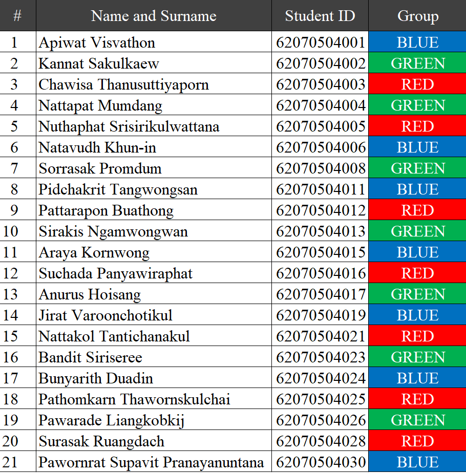

# INC362 Programming Skill Evaluation #1

## Instructions:

- There are two questions.

- Each question gives you 5 points.

- You have 25 minutes to complete the two.

- You must follow the given requirements (`-2` per wrong point).

- Submit your codes into the provided google form.

- When time-out, the submission system will close automatically.

- ALL communication are not allowed. `DO NOT CHEAT!!`.

- `WARNING:` Your screen will be continuously monitored by system and/or committee.

---

## How to complete your code?

Write you code in the given template.


`Template`

``` C#
//--- Variable Start -------------------------

//>> REPLACE THIS LINE WITH YOUR VARIABLE HERE

//--- Variable End ---------------------------


//--- Method Start ---------------------------

//>> REPLACE THIS LINE WITH YOUR METHOD HERE

//--- Method End -----------------------------
```

---

## How to submit your code?

Copy all lines of your code including the `Variable Start` and `Method End` lines, and paste into the given google form.  

---

## How the committee evaluate/check your code?
All lines of you code will be copied, pasted and executed to check all requirements and result.


`Evaluation`

Your method will be called from the Form1 constructor as show below.

``` C#
//
// All lines of your code will be copied and pasted here.
//

public Form1()
{
    InitializeComponent();

    // Your method will be called here
    DATA_TYPE VARIABLE = YOUR_METHOD_NAME(PARAMETER_VALUE);
}
```

---

## Example:

**Question:** Write a method named "GenBool" to generate and return a boolean data.

**Your code will look like this:**

```C#
//--- Variable Start -------------------------

Random rnd = new Random();

//--- Variable End ---------------------------


//--- Method Start ---------------------------

private bool GenBool()
{
    return random.Next() % 2 > 0;
}

//--- Method End -----------------------------
```

---


## Evaluation (for Evaluator/Checker only)

The evaluator/checker will copy, paste and run your code like this:

```C#

//** All lines of your code will be copied and pasted here.

//--- Variable Start -------------------------

Random rnd = new Random();

//--- Variable End ---------------------------


//--- Method Start ---------------------------

private bool GenBool()
{
    return random.Next() % 2 > 0;
}

//--- Method End -----------------------------


public Form1()
{
    InitializeComponent();

    bool data = GenBool();
}
```

---


## Link for your questions:

🔴 [Questions for RED](https://github.com/drsanti/temporal-repository/blob/main/G1-RED/Questions.md)

🟢 [Questions for GREEN](https://github.com/drsanti/temporal-repository/blob/main/G2-GREEN/Questions.md)

🔵 [Questions for BLUE](https://github.com/drsanti/temporal-repository/blob/main/G3-BLUE/Questions.md)

---

## Link for Submission:

https://forms.gle/BV7xH1JpoXhqQjgL6

---

## Yor group color:


